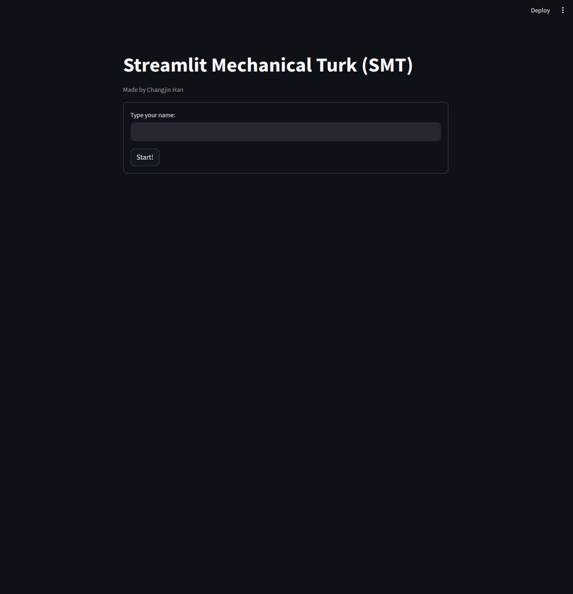
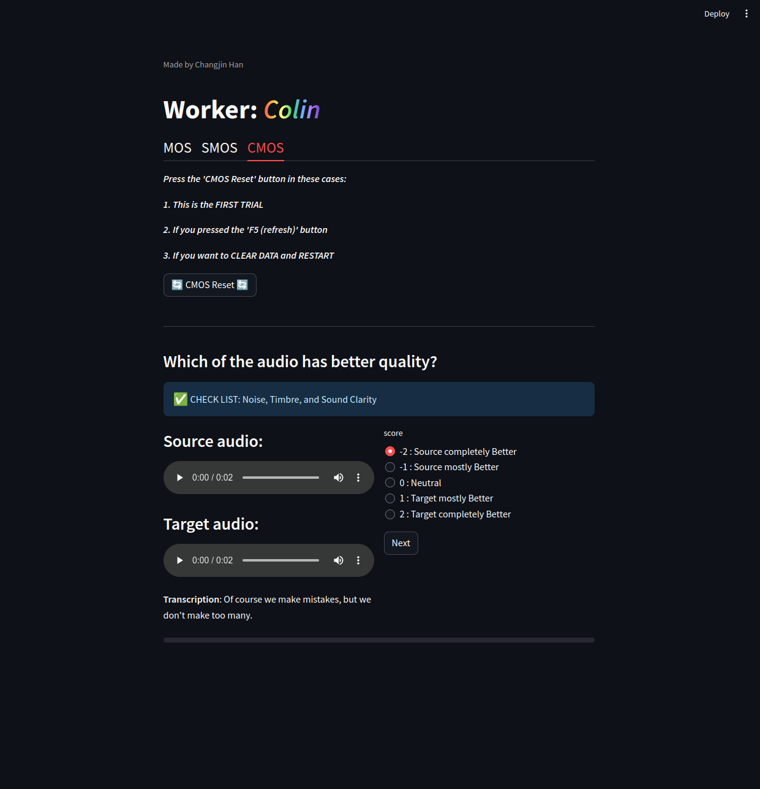

# Streamlit Mechanical Turk (SMT)
Inspired by [Amazon Mechanical Turk](https://www.mturk.com/), I created a survey template based on [Streamlit](https://streamlit.io/). This template can be used to employ participants for evaluating the performance of generative models. Currently, it offers a template specifically designed for **audio evaluations**. The template supports mean opinion score (MOS), similarity MOS (SMOS), and comparative MOS (CMOS) evaluations, and I hope it serves as a useful tool for researchers working on audio or speech synthesis.

## Setup
I tested on Python 3.10.0. You should install pandas and Streamlit using 
```
pip install pandas streamlit
```
Place the audio files and metadata required for evaluation in the `testset` folder.
Please separate the audio files into folders based on each task (MOS, SMOS, CMOS) and place them accordingly. For the metadata required for each task, refer to the sample `.csv` files provided.

## Run
```
streamlit run main.py --server.port 8501
```
If you don't specify a port, the default port is 8501.
Open the streamlit page http://localhost:8501.


## Survey Process
Workers will log in by entering their name on the page and perform each task in the order specified in the metadata. Each time "next" is clicked, the worker's progress is recorded in real-time in the `results` folder, and the time taken for each task will be displayed on the screen once the task is completed. Feel free to customize according to the information you wish to obtain from the survey!

### Screenshots
<p float="left">
  
  
  
  
</p>